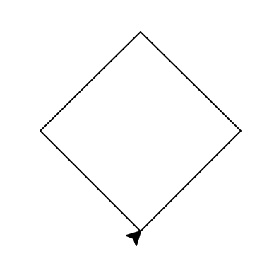
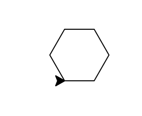
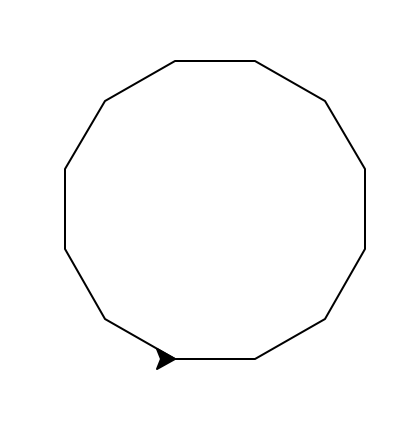
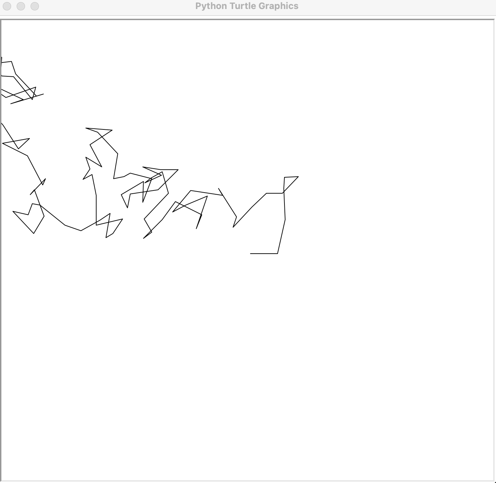

## Program of the Day #9

Write a program to print the results of rolling $n$ distinct $d$-sided dice. The program takes two command line arguments: the first is a number ($d$) of sides on a die; the second is a number of such dice ($n$). A **d**-sided die has numbers from 1 to **d** and each of them is equally likely to land facing up. Assume both numbers are integers 1 or greater.

The program produces two lines of output. The first line of the prints the result of each die roll, separated by a space. The second line prints the average of the values rolled, as a floating-point number. For example, here are two outputs for rolling 2 6-sided dice:

```
>>> %Run P09_dice.py 6 2
2 4 
3.0
>>> %Run P09_dice.py 6 2
1 3 
2.0
```

and here's an example of rolling 4 12-sided dice:

```
>>> %Run P09_dice.py 12 4
6 10 8 10 
8.5 
```


## Other Practice Problems

1. Write a program that generates and prints random integers between 1 and 10 (inclusive) until one of the random numbers exceeds 8. At the end, print how many numbers were generated. Here's one run of the program (of course, the output will be different each time!).

   ```
   4
   5
   4
   Generated 3 numbers.
   ```

3. Write a program that creates a turtle object and draws the following picture. This is a square with side length 100, but drawn tilted at a 45-degree angle. The turtle's location in the picture is its starting point, i.e., the middle of the canvas.
   

4. Write a program that creates a turtle and uses it to draws an **n**-sided polygon with side length **s**. The program takes **n** and **s** as **command line arguments**. *Hint:* the square I drew in lecture was a 4-sided polygon with side length 100. *Hint 2:* Regardless of the number of sides, the turtle needs to turn a total of 360 degrees while drawing the entire polygon.

   Here's the result of drawing a 6-sided polygon (hexagon) with side length 30:

   

   and here's a 12-sided polygon (dodecagon) with side length 40:

   

5. Write a program to make a turtle do a **random walk**. In other words, repeat the following 100 times:

   * Move a random distance forward
   * Turn a random number of degrees

   I chose a random distance forward between 10 and 50, but you can choose whatever distance you'd like. Here's one output:

   If you're feeling fancy, devise a way to modify the program to prevent the turtle from walking off the screen.
