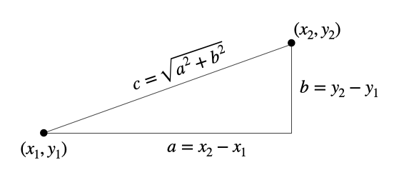
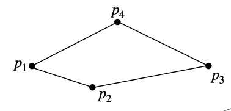
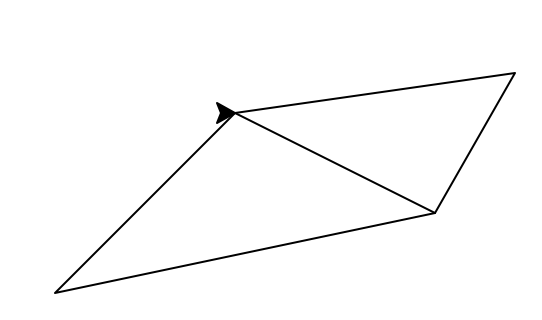
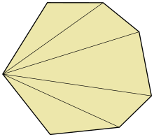

## Program of the Day #12

In this problem, we'll continue on our theme of working with times of day. The main program's purpose is to determine whether a time conflicts with an event. In particular, the program takes three times as input: a start, and end time, and a query time. The output tells the user whether the query time conflicts with an event that runs from the start time to end time, or in other words, is between the start and end times.

You'll implement three functions and the remainder of the main program. The first two of these functions are similar to ones you've written before, but take advantage our new knowledge of tuples to make things easier to work with.

* `to_seconds` does the same thing as the old `to_seconds`, except now it takes tuple containing (hours, minutes, seconds) as its single argument.

* `to_hms` is similar to `print_hms`, except that instead of printing hh:mm:ss, it returns a tuple containing (hour, minute, second) which can then be further processed by whomever called it.

* `conflicts` implements the conflict check used in the main program: it takes a start, end, and query, and returns a the boolean representing whether the query conflicts with the interval from start to end. *Hint*: this can be done while keeping the times in hour, minute, second format, but the check is much easier after converting to raw seconds!

* The main program already reads the three times from command line arguments. Complete the main program so that it prints a message as in the following examples:

  ```
  >>> %Run P12_timeconflict.py 09 00 00 09 50 00 09 49 41
  (9, 49, 41) conflicts with the interval from (9, 0, 0) to (9, 50, 0)
  >>> %Run P12_timeconflict.py 09 00 00 09 50 00 12 00 00
  (12, 0, 0) does not conflict with the interval from (9, 0, 0) to (9, 50, 0)
  ```

## Other Practice Problems

1. Recall that the distance between two points can be calculated using the pythagorean theorem. The distance between the two points is the hypotenuse of a triangle formed by the difference in $x$ coordinates and the difference in $y$ coordinates:

   

   With this in mind, implement the following function:
   
   ```python
   def distance(p1, p2):
       """ Return the distance between 2D points p1 and p2. 
       Precondition: p1 and p2 are 2-tuples containing the
       x and y coordinates of the two points. """
   
       # your code here
   ```
   
2. A common task in computer graphics is to *triangulate* a polygon - or in other words, generate a collection of triangles that cover a polygon. A simple case of this is triangulating a quadrilateral - or in other words, splitting a 4-sided shape into two triangles. We'll assume that the quadrilateral in question is convex (i.e., the line between any pair of vertices does not leave the quadrilateral). We can triangulate this shape by connecting one pair of opposite points with a line. For example, the following quadrilateral can be triangulated by either connecting $p_1$ and $p_3$ or connecting $p_2$ and $p_4$. For various reasons it turns out to be desirable to have triangles whose smallest angle isn't too small; this means that in the shape below, a better triangulation would be to connect $p_2$ and $p_4$.

   

   Implement the following function, which returns the pair of opposite points that are closest together. You can make use of the `distance` function you implemented above.

   ```python
   def best_divider(p1, p2, p3, p4):
       """ Return the closest pair of opposite points on the quadrilateral formed by p1,
       p2, p3, and p4. Precondition: p1-p4 are 2-tuples of numbers specifying a
       quadrilateral in counter-clockwise order. """
   ```

3. Implement the following function to draw a triangulation of a quadrilateral using a turtle. You can make use of any of the functions you've written so far. You also may want to check out the turtle's `goto` method to help make things a little simpler.

   ```python
   def draw_triangulation(t, p1, p2, p3, p4):
       """ Draw the triangulated quadrilateral defined by vertices p1, p2, p3, p4 using
       the turtle t. The triangulation connects the closer pair of opposing points.
       Precondition: t is a turtle; p1-p4 are 2-tuples of numbers specifying a
       quadrilateral in counter-clockwise order."""
   ```

   Test your program using a main program like the following:

   ```python
   import turtle
   
   # define your function(s) here
   
   q = turtle.Turtle()
   p1 = (10, 10)
   p2 = (200, 50)
   p3 = (240, 120)
   p4 = (100, 100)
   draw_triangulation(q, p1, p2, p3, p4) 
   ```

   When I run this, I get a drawing in the turtle window that looks like this:

   

4. (*) Polygons with more vertices are trickier to optimally triangulate, because there are more choices of pairs of vertices to connect. A simple, foolproof method for getting *a* triangulation (but not necessarily an *optimal* one) is called a [*fan triangulation*](https://en.wikipedia.org/wiki/Fan_triangulation). Starting at one vertex, a line is drawn to connect that vertex to each other one that's not adjacent to it, as in the example image below:

   

   Implement the following function, which draws a fan-triangulated picture of a polygon specified by a *list* of vertices.

   ```python
   def draw_fan_triangulation(t, poly):
       """ Draw a fan-triangulated picture of the polygon specified by poly.
       Preconditions: t is a turtle; poly is a list of 3 or more 2-tuples of numbers
       that give the vertices of a convex polygon in counter-clockwise order. """
   ```

   *Hint:* You may find it helpful to be able to access a specific element of the list: you can do this with `poly[i]`, where `i` is the *index* of the vertex you want, starting with 0 as the first element. 

   Write a main program to test your function.

5. (*) See if you can devise a method for triangulating a convex polygon that will minimize long-and-narrow triangles. This could involve a fan triangulation with a carefully chosen starting vertex, or a different approach entirely. Focus on the algorithm first, writing it in pseudocode; once you've got something you think will work, feel free to go ahead and write Python code to implement it.