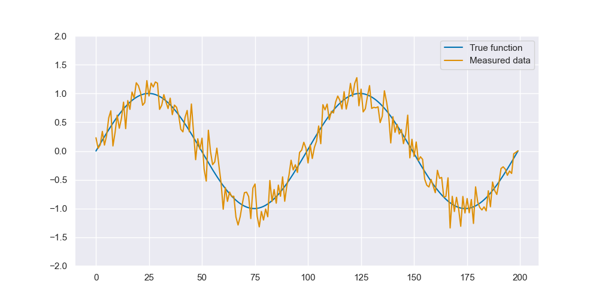
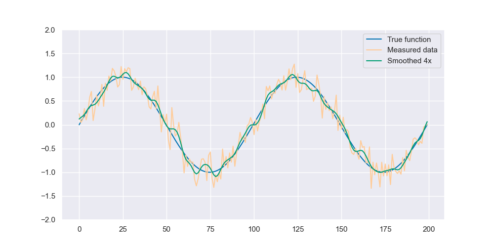

## Program of the Day #15

A common problem in science and engineering is *measurement noise*. Anytime you're trying to measure some signal (say, a person's heartbeat, the humidity at a weather station, the electrical current at a particular point in a circuit, etc.), your measurement instrument usually isn't perfectly accurate. You end up with measurements that are pretty close to the true value, and would be correct on average if you took lots of measurements, but they're *noisy*:



To get a better estimate of the true underlying signal, it often helps to *smooth* the data. There are various strategies for doing this, but one simple one is to replace each datapoint with an average of its neighbors.

The result of this sort of smoothing is a function (green, below) that's much closer to the original signal that would have been recorded with no measurement noise:



For today's program, you will write a function that performs this smoothing operation on a list of numbers. 

As a warm-up, and also a potentially helpful building block, start by implementing a function that averages a list of numbers:

```python
def mean(nums):
    """ Return the arithmetic mean (i.e., average) of the list of numbers
    nums. Precondition: nums is not empty and contains only numbers. """
```

Secondly, you will write a function to perform smoothing on the list. The basic operation being performed is: create a new list where each element in the new list is the average of the corresponding element in the old list and its two (left and right) immediate neighbors. Since we're looking left and right, we need to decide what to do about the first and last element - in this case, we will wrap around to the end and beginning of the list, respectively. See the docstring for a concrete example of what this looks like.

```python
def smooth(nums):
    """ Return a smoothed copy of nums, where each element in the resulting
    list is the average of its old value and its two neighbors. The neighbor
    relation "wraps": that is, the first element's left neighbor should be the
    last element, and similarly the last element's right neighbor is the first
    element. For example, if we call smooth([a, b, c, d]), it should return a
    list [a', b', c', d'], where:
        a' is the average of d, a, and b
        b' is the average of a, b, and c
        c' is the average of b, c, and d
        d' is the average of c, d, and a
    Preconditions: nums contains only numbers and has length at least 3.
    This function does *not* modify the input list (nums)."""
```

The main program is not unit tested, but should work as follows:

* It takes at least 4 command line arguments. The first is the integer *number of times* the list is to be smoothed using the `smooth` function. Here we'll call this number $N$
*  The rest of the arguments are the list of numbers to operate on. You now recognize that `sys.argv` is a list, so all of our usual list functionality is available to us when working with it. The main program creates a list of `float`s out of the remaining arguments. Your program does not need to handle erroneous inputs that can't be converted to floats.
* The `smooth` function is applied repeatedly, $N$ times - to iteratively smooth the input list. Remember that `smooth` returns a new list and leaves the old one unchanged.
* After each smoothing iteration, the list is printed using the provided `print_rounded` function. This rounds the numbers to 2 decimal places before printing so they are more concise (though less precise) when printed. After the list, the mean of the list is printed.

An example run of the program looks like this:

```
>>> %Run P15_smooth.py 10 1 2 3 4 5
[2.67, 2.00, 3.00, 4.00, 3.33] Mean: 3.0
[2.67, 2.56, 3.00, 3.44, 3.33] Mean: 3.0
[2.85, 2.74, 3.00, 3.26, 3.15] Mean: 3.0
[2.91, 2.86, 3.00, 3.14, 3.09] Mean: 3.0
[2.95, 2.93, 3.00, 3.07, 3.05] Mean: 3.0
[2.98, 2.96, 3.00, 3.04, 3.02] Mean: 3.0
[2.99, 2.98, 3.00, 3.02, 3.01] Mean: 3.0
[2.99, 2.99, 3.00, 3.01, 3.01] Mean: 3.0
[3.00, 2.99, 3.00, 3.01, 3.00] Mean: 3.0
[3.00, 3.00, 3.00, 3.00, 3.00] Mean: 3.0
```

Note that, because math operations on `float`s are slightly imprecise, the `Mean` printed after each iteration may be slightly different; this is normal, and differences in the mean on the order of $10^{-5}$ or smaller are likely not due to a bug in your program. Beacuse our lists are printed in rounded form, the list elements should display exactly the same, but the means may not; for example:

```
>>> %Run P15_smooth.py 4 0 2 3 4 9
[3.67, 1.67, 3.00, 5.33, 4.33] Mean: 3.599999999999999
[3.22, 2.78, 3.33, 4.22, 4.44] Mean: 3.599999999999999
[3.48, 3.11, 3.44, 4.00, 3.96] Mean: 3.6
[3.52, 3.35, 3.52, 3.80, 3.81] Mean: 3.599999999999999
```

## Other Practice Problems

1. Implement and test the following function:

   ```python
   def censor(text, words):
       """ Return a copy of text (a string) with all instances of each string in words
       (a list of strings) removed. """
   ```

2. Write a program that repeatedly prompts a user for words until they enter "exit" (with any capitalization). For each word entered, print a message saying whether or not it's a duplicate of a word already entered. When determining duplicates, ignore case: "Banana" should be considered a duplicate if "banana" was entered previously.

3. Implement and test the following function:

   ```python
   def is_sorted(my_list):
       """ Return true if and only if my_list is in sorted (ascending) order.
       Precondition: my_list contains all numbers OR all strings, but not a mix. """
   ```

4. Write a program to play a text-only version of the memory game [Simon](https://en.wikipedia.org/wiki/Simon_(game)). For each round of the game, print a sequence of random colors chosen from "Red", "Green", "Blue", and "Yellow", and wait for the user to press enter. Then, print enough newline characters to clear the screen, and prompt the user to re-enter the sequence of colors from memory. Start the first round with a sequence length of one, increasing it by one in each subsequent round. If the player fails to enter the sequence correctly, they lose and the program terminates. 

5. Write a program that repeatedly prompts a user for positive numbers, stopping when they enter a negative number. Afterwards, print the numbers they entered in sorted (ascending) order. To keep things interesting, don't use the `sort` or `sorted` functions.
